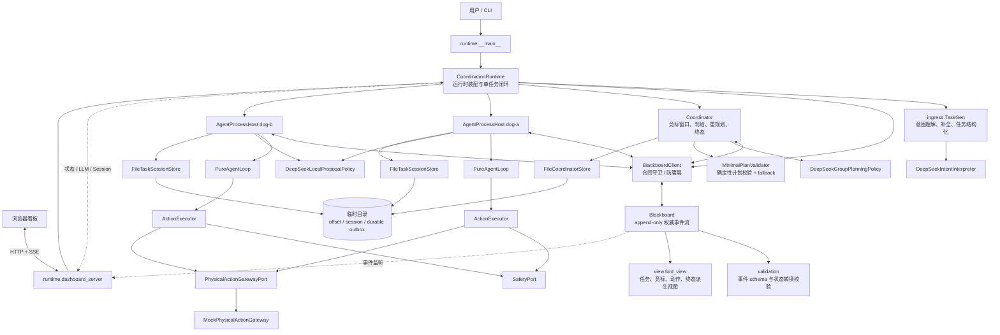
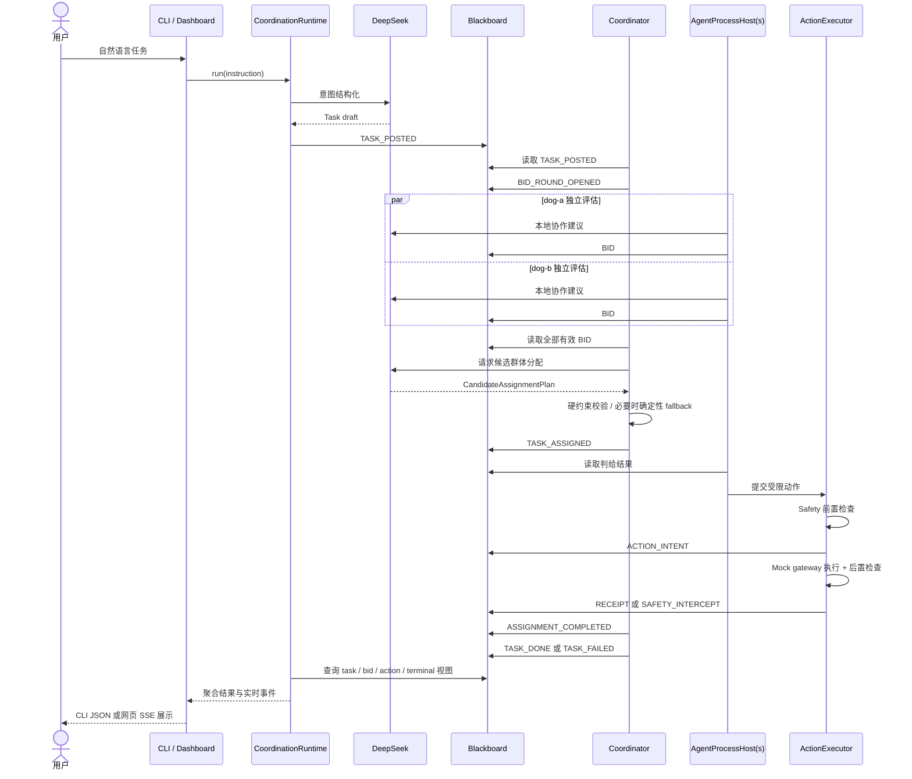
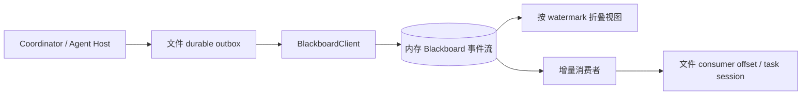

# SwarmBrain 代码架构

本文以当前正式入口 `python -m swarm_brain.runtime` 的 coordination v2 链路为主，旧版
`runtime.skeleton` 仅作为早期六层骨架保留，不属于当前生产演示主链路。

## 1. 总体架构



架构中心是 Blackboard。Coordinator 和各设备 Agent 不直接互调，而是读取黑板事件、
计算下一步效果，再把新事件写回黑板。`CoordinationRuntime` 负责装配组件，并在当前演示中
按确定顺序推进各消费者，形成单进程、内存黑板、mock 物理执行的完整闭环。

## 2. 主流程时序



正常演示的关键事件链为：

```text
TASK_POSTED
  -> BID_ROUND_OPENED
  -> BID (每台设备)
  -> TASK_ASSIGNED
  -> ACTION_INTENT
  -> RECEIPT
  -> ASSIGNMENT_COMPLETED
  -> TASK_DONE
```

异常和动态调整分支包括 `SAFETY_INTERCEPT`、`CLUE -> TASK_REPLAN`、`ESTOP` 和
`TASK_FAILED`。

## 3. 目录与职责

| 目录 | 当前职责 | 关键文件 |
| --- | --- | --- |
| `runtime/` | 正式入口、依赖装配、DeepSeek 适配、网页看板 | `coordination_runtime.py`, `deepseek.py`, `dashboard_server.py` |
| `ingress/` | 自然语言任务生成、补全和 v2 任务负载转换 | `task_gen.py` |
| `contracts/` | 全系统共享的数据契约、事件类型、端口 Protocol | `blackboard_event.py`, `task.py`, `interfaces.py` |
| `blackboard/` | 权威 append-only 事件存储、幂等与转换校验、派生视图 | `board.py`, `validation.py`, `view.py` |
| `coordination/` | Coordinator、设备 Agent 状态机、竞标/判给策略、动作执行 | `coordinator.py`, `agent_process.py`, `agent_loop.py`, `policy.py` |
| `safety/` | 安全、自治等级、可逆性和急停的旧版/扩展实现 | `guardrail.py`, `autonomy.py`, `estop.py` |
| `access/` | 设备注册、工具网关、设备适配器和遥测 | `registry.py`, `tool_gateway.py`, `adapters/` |
| `assets/` | Skill、Trace、自进化和运营账本骨架 | `skill.py`, `trace.py`, `evolution.py` |
| `memory/` | 记忆层接口占位 | `__init__.py` |

## 4. 核心组件

### CoordinationRuntime

`runtime/coordination_runtime.py` 是 composition root，也是正式演示的流程驱动器。它创建：

- 内存 `Blackboard` 和 `BlackboardClient`；
- 两个默认设备 `dog-a`、`dog-b` 的公开快照；
- 一个 `Coordinator`；
- 每台设备一个 `AgentProcessHost + PureAgentLoop + ActionExecutor`；
- DeepSeek 的意图、本地建议、群体规划三个适配器；
- 临时文件形式的 consumer offset、session 和 durable outbox。

当前 `process_mode` 是 `single_process_in_memory`。代码具备 `AgentProcessSupervisor` 的多进程
骨架，但正式演示入口直接使用 Host，并通过 `poll_once()` 确定性推进。

### Blackboard

`blackboard/board.py` 是当前唯一权威事实源：

- 事件只追加，不原地更新；
- 通过 `idempotency_key` 去重并检测冲突；
- 为事件分配 offset、version 和时间戳；
- 校验事件 schema、账本归属和 v2 状态转换；
- 从事件流折叠出 task、bid round、evidence、action、terminal、agent public 视图。

四类账本定义在 `contracts/blackboard_event.py`：`task`、`evidence`、`receipt`、`human`。
Agent 公开快照是低频旁路数据，不构成第五类事件账本。

### Coordinator

`coordination/coordinator.py` 是跨设备控制面：

- 监听任务与协同事件；
- 打开和关闭竞标窗口；
- 收集 BID 并构造群体规划输入；
- 调用群体模型生成候选分配；
- 使用 `MinimalPlanValidator` 校验硬约束，失败时走确定性最大匹配；
- 根据回执发布角色完成和任务终态；
- 处理线索重规划、急停、Agent 退出及恢复。

### AgentProcessHost 与 PureAgentLoop

每个设备拥有独立消费 offset、任务 Session 和 outbox。Host 负责 I/O 与生命周期，
`PureAgentLoop` 负责纯状态转换：

- `BID_ROUND_OPENED`：确定性资格评估生成硬 BID；DeepSeek 只能附加协作建议；
- `TASK_ASSIGNED`：非赢家进入 standby，赢家构造动作效果；
- `RECEIPT`：更新 Intent/Session，并产生完成效果；
- `TASK_DONE` / `TASK_FAILED`：收敛并清理任务本地状态。

### ActionExecutor

`coordination/action_executor.py` 把判给转换成标准动作意图，执行顺序是：

```text
校验 payload -> Safety 前置检查 -> 写 ACTION_INTENT
-> PhysicalActionGateway 执行 -> Safety 后置检查
-> 写 RECEIPT / SAFETY_INTERCEPT
```

当前运行时注入的是 `StaticSafetyPort` 和 `MockPhysicalActionGateway`，因此属于合同级闭环，
尚未连接真实机器人。

### DeepSeek 边界

DeepSeek 被限制在三个策略点：

1. `DeepSeekIntentInterpreter`：自然语言转结构化任务草案；
2. `DeepSeekLocalProposalPolicy`：为设备硬 BID 附加非权威协作建议；
3. `DeepSeekGroupPlanningPolicy`：生成候选团队分配。

模型不能直接写黑板、绕过安全门控或提交最终判给。所有模型输出都要经过结构校验，群体分配
还必须通过确定性计划验证器。

## 5. 持久化与一致性

当前事实数据与进程私有状态采用两种不同存储：



- Blackboard 事件流：当前仅驻留内存，是本次运行的权威事实源；
- 文件 outbox：写黑板前先落盘，支持幂等重放；
- consumer offset：记录每个 Coordinator/Agent 的消费位置；
- task session：保存 Agent 对任务和动作意图的私有状态；
- `TemporaryDirectory`：任务运行结束后自动删除，所以当前并非跨整次程序运行的永久存储。

## 6. 当前实现边界

| 能力 | 当前状态 |
| --- | --- |
| 自然语言结构化 | DeepSeek 真调用 |
| 双 Agent 独立竞标 | 已实现 |
| 群体候选规划 | DeepSeek 真调用 + 确定性校验/fallback |
| 黑板事件、幂等、状态转换、派生视图 | 内存实现，已覆盖测试 |
| 动作安全与物理执行 | 静态安全策略 + mock gateway |
| Coordinator/Agent 私有恢复状态 | 临时文件 outbox/session/offset |
| 网页实时展示 | 标准库 HTTP Server + SSE |
| 真机、长期持久化、分布式消息总线 | 尚未接入正式运行时 |
| `runtime.skeleton` 的 access/assets/safety 六层链路 | 旧版兼容演示，不是 v2 主入口 |

## 7. 依赖方向

```text
contracts <- blackboard
contracts <- ingress
contracts <- access / safety / assets
contracts + blackboard + ports <- coordination
all modules <- runtime（唯一装配层）
```

设计约束是下层不引用上层，业务协同通过 Blackboard 事件完成。遥测、急停和人工授权是明确
定义的旁路，但仍应留下相应事件或 Trace 记录。
